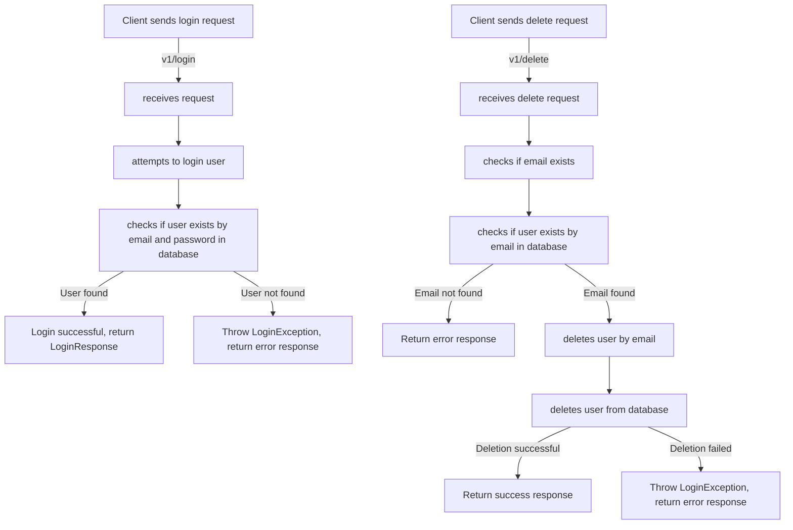

```mermaid
flowchart TD
    A[Client sends login request] --> |v1/login| B[receives request]
    B --> C[attempts to login user]
    C --> D[checks if user exists by email and password in database]
    D -->|User found| F[Login successful, return LoginResponse]
    D -->|User not found| G[Throw LoginException, return error response]

    A1[Client sends delete request] --> |v1/delete| B1[receives delete request]
    B1 --> C1[checks if email exists]
    C1 --> D1[checks if user exists by email in database]
    D1 -->|Email not found| F1[Return error response]
    D1 -->|Email found| G1[deletes user by email]
    G1 --> H1[deletes user from database]
    H1 -->|Deletion successful| I1[Return success response]
    H1 -->|Deletion failed| J1[Throw LoginException, return error response]
```
