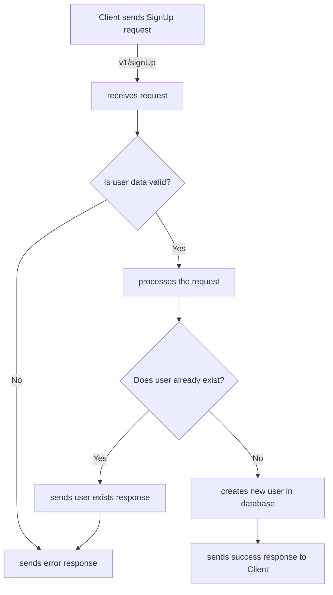

```mermaid
flowchart TD
    A[Client sends SignUp request] --> |v1/signUp| B[receives request]
    B --> C{Is user data valid?}
    C -->|Yes| D[processes the request]
    C -->|No| E[ sends error response]
    D --> F{Does user already exist?}
    F -->|Yes| G[sends user exists response]
    F -->|No| H[creates new user in database]
    H --> K[sends success response to Client]
    G --> E
```
