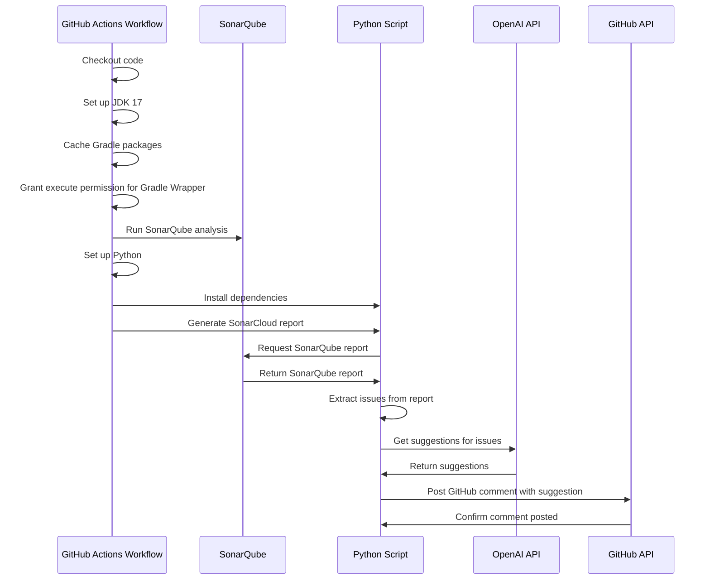

```mermaid
sequenceDiagram
 participant GitHub_Actions as GitHub Actions Workflow
 participant SonarQube as SonarQube
 participant Python_Script as Python Script
 participant OpenAI as OpenAI API
 participant GitHub as GitHub API

 GitHub_Actions->>GitHub_Actions: Checkout code
 GitHub_Actions->>GitHub_Actions: Set up JDK 17
 GitHub_Actions->>GitHub_Actions: Cache Gradle packages
 GitHub_Actions->>GitHub_Actions: Grant execute permission for Gradle Wrapper
 GitHub_Actions->>SonarQube: Run SonarQube analysis
 GitHub_Actions->>GitHub_Actions: Set up Python
 GitHub_Actions->>Python_Script: Install dependencies
 GitHub_Actions->>Python_Script: Generate SonarCloud report
 Python_Script->>SonarQube: Request SonarQube report
 SonarQube->>Python_Script: Return SonarQube report
 Python_Script->>Python_Script: Extract issues from report
 Python_Script->>OpenAI: Get suggestions for issues
 OpenAI->>Python_Script: Return suggestions
 Python_Script->>GitHub: Post GitHub comment with suggestion
 GitHub->>Python_Script: Confirm comment posted
```
